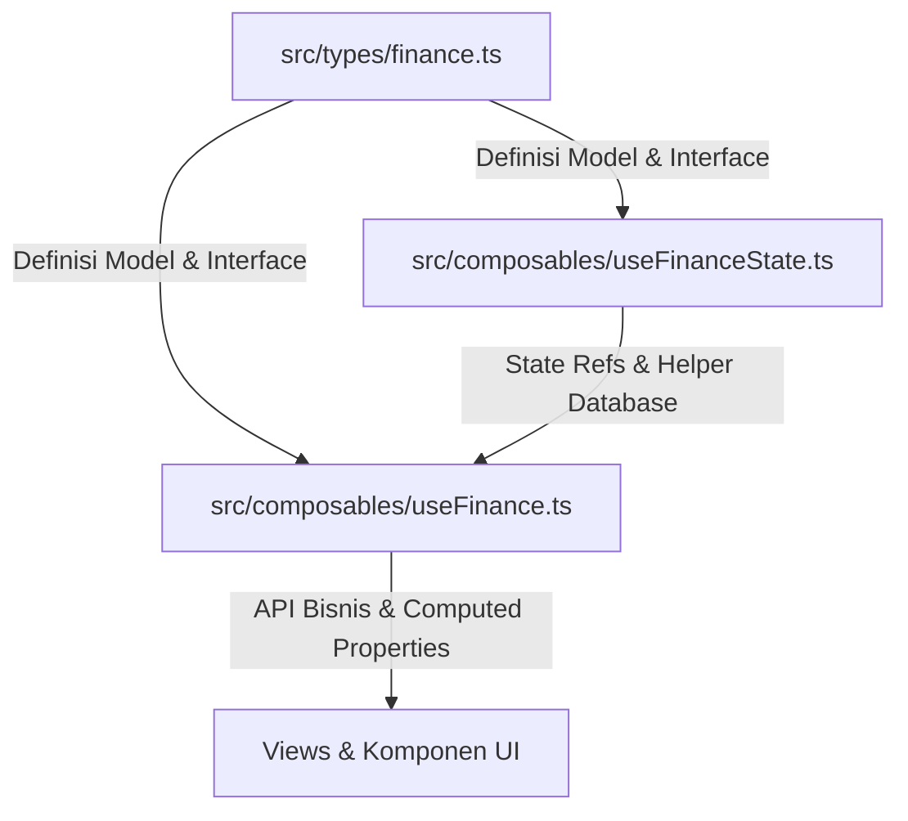

# 📊 Finance Flow — Aplikasi Laporan Keuangan Pribadi

**Finance Flow** adalah aplikasi pengelolaan keuangan pribadi (Personal Finance Management) modern berbasis web yang dirancang dengan antarmuka premium, dinamis, dan sangat responsif. Aplikasi ini berjalan secara **client-side (offline-first)** demi mengutamakan privasi penuh pengguna—seluruh data keuangan disimpan dan dienkripsi secara lokal di dalam browser Anda.

---

## 🚀 Fitur & Keunggulan Utama

*   📊 **Dashboard & Engine Wawasan Otomatis (Insights Engine)**: 
    Menyediakan kartu ringkasan keuangan (Saldo Aktual, Total Pemasukan/Pengeluaran, Aset, Utang/Piutang) dan sistem wawasan pintar yang mendeteksi jika anggaran melebihi batas, melacak peningkatan rasio tabungan, serta mengingatkan tagihan berulang.
*   💸 **Pencatatan Arus Kas & Ekspor Excel**: 
    Catat transaksi harian secara detail (kategori, sub-kategori, nominal, catatan). Hasil pencatatan dapat difilter secara fleksibel dan diekspor ke file Excel `.xlsx` secara instan menggunakan SheetJS.
*   📝 **Penyusunan Anggaran & Transaksi Berulang**: 
    Tentukan batasan pengeluaran bulanan per kategori dan pantau persentase pemakaian secara reaktif. Jadwalkan transaksi berulang (seperti gaji, sewa, asuransi) untuk otomatis dicatat setiap bulannya.
*   🎯 **Target Tabungan & Dana Darurat**: 
    Buat target finansial masa depan lengkap dengan visualisasi progress-bar dan kalkulator waktu pencapaian otomatis berdasarkan kontribusi bulanan Anda.
*   🏦 **Manajemen Aset & Net Worth**: 
    Lacak portofolio kekayaan Anda (Kas, Saldo Bank, Investasi). Dilengkapi pencatatan historis apresiasi nilai (📈) atau penyusutan nilai (📉) aset yang dapat disinkronkan ke arus kas.
*   🤝 **Utang & Piutang**: 
    Kelola kewajiban utang dan tagihan piutang secara terorganisir dengan detail counterpart, tenggat jatuh tempo, filter status pelunasan, serta modal koreksi.
*   📈 **Laporan Lanjutan & Grafik Candlestick**: 
    Analisis visual mutakhir menggunakan Chart.js yang mencakup distribusi pengeluaran serta grafik **Balance Candlestick** untuk melihat rentang saldo tertinggi, terendah, pembukaan, dan penutupan harian.
*   ⚙️ **Kustomisasi Kategori & Dynamic Theme Engine**: 
    Buat kategori kustom dengan warna dan emoji unik. Personalisasikan tampilan aplikasi dengan 6 preset tema premium: *Ocean Light, Forest Light, Sunset Light, Midnight Blue, Graphite Dark,* dan *Ruby Dark*.
*   🔒 **Keamanan Kunci PIN**: 
    Amankan privasi data keuangan Anda dari akses tidak sah dengan 4-digit sandi PIN yang divalidasi melalui virtual keypad beranimasi lengkap dengan feedback getar (vibration API).
*   🌐 **Service Worker & Akses Offline (Offline-First)**:
    Dilengkapi dengan Service Worker (`sw.js`) menggunakan strategi *Stale-While-Revalidate* untuk meng-cache aset statis. Aplikasi dapat diakses secara penuh dalam kondisi luring (offline) secara cepat dan andal, serta mendukung pengiriman notifikasi pengingat lokal.
*   ⚡ **Floating Apps & Utilitas Cepat**: 
    Akses cepat melayang di pojok layar untuk menambahkan transaksi kilat, berganti tema secara instan, mengunduh file backup JSON data keuangan, serta tombol *scroll-to-top* yang mulus.

---

## 🛠️ Tech Stack & Teknologi

Aplikasi ini dibangun menggunakan teknologi modern terbaik di ekosistem frontend:

*   **Framework Utama**: [Vue 3](https://vuejs.org/) (Composition API, `<script setup>`)
*   **Compiler & Bundler**: [Vite](https://vite.dev/)
*   **Runtime Engine**: [Bun](https://bun.sh/) (Dapat juga dijalankan dengan Node.js)
*   **Bahasa Pemrograman**: [TypeScript](https://www.typescriptlang.org/)
*   **Desain & Styling**: CSS dengan [Tailwind CSS v4](https://tailwindcss.com/)
*   **Routing**: [Vue Router](https://router.vuejs.org/)
*   **Visualisasi Bagan**: [Chart.js](https://www.chartjs.org/) / [Vue-Chartjs](https://vue-chartjs.org/)
*   **Utilitas Data**: [SheetJS (xlsx)](https://sheetjs.com/)

---

## 📂 Struktur & Arsitektur Proyek

Finance Flow menggunakan arsitektur manajemen state 3-lapis (*Modular Shared Singleton State*) untuk pemisahan logika bisnis dari UI secara bersih:



*   **Layer 1 (Definisi Data)** — [types/finance.ts](frontend/src/types/finance.ts): Menampung semua definisi tipe data TypeScript.
*   **Layer 2 (Core State)** — [useFinanceState.ts](frontend/src/composables/useFinanceState.ts): Berfungsi sebagai *shared singleton state* reaktif dan manajemen penyimpanan database `localStorage`.
*   **Layer 3 (Presenter API)** — [useFinance.ts](frontend/src/composables/useFinance.ts): Logika bisnis, CRUD, kalkulasi finansial real-time, dan deteksi analisis wawasan.

---

## 📖 Pusat Dokumentasi Internal

Dokumentasi lengkap dan mendetail mengenai arsitektur internal aplikasi dapat dibaca melalui tautan berikut:

1.  📋 **[Konteks Utama & Struktur Folder (context.md)](frontend/docs/context.md)**: Gambaran umum proyek, arsitektur file, dan petunjuk setup awal.
2.  ⚡ **[Manajemen State Global (state-management.md)](frontend/docs/state-management.md)**: Detail pemisahan state reaktif, persistensi data `localStorage`, dan model data utama.
3.  🔒 **[Alur Keamanan PIN (security-flow.md)](frontend/docs/security-flow.md)**: Alur penjaminan privasi melalui keypad virtual, event sinkronisasi, dan status sesi.
4.  🧭 **[Navigasi & Routing (routing-navigation.md)](frontend/docs/routing-navigation.md)**: Konfigurasi rute halaman, sidebar responsif, date filter global, dan scroll reset.
5.  ⚙️ **[Fitur & Modul Utama (features.md)](frontend/docs/features.md)**: Pembahasan teknis mendalam tentang fungsionalitas di tiap menu aplikasi.

---

## ⚙️ Petunjuk Menjalankan Aplikasi Secara Lokal

Pastikan Anda telah memasang **Bun** (direkomendasikan) atau **Node.js** di komputer Anda.

### 1. Masuk ke Folder Proyek
```bash
cd frontend
```

### 2. Instalasi Dependensi
```bash
# Menggunakan Bun
bun install

# Menggunakan NPM
npm install
```

### 3. Jalankan Server Pengembangan (Local Dev Server)
```bash
# Menggunakan Bun
bun dev

# Menggunakan NPM
npm run dev
```
Buka peramban pada alamat lokal yang tertera di terminal Anda (biasanya `http://localhost:5173`).

### 4. Melakukan Build untuk Produksi
```bash
# Menggunakan Bun
bun run build

# Menggunakan NPM
npm run build
```
Hasil kompilasi file statis siap sebar (deploy) akan berada di dalam folder `dist`.

---

## 🍀 Deployment dengan PM2 (Production)

Aplikasi ini dilengkapi dengan berkas konfigurasi [ecosystem.config.cjs](file:///d:/Programming/bun/vue-laporan-keuangan/ecosystem.config.cjs) untuk deployment menggunakan **PM2** dan **Bun**.

### Langkah-langkah Deployment:

1. **Lakukan Build Produksi**:
   ```bash
   cd frontend
   bun run build
   cd ..
   ```
2. **Jalankan Aplikasi dengan PM2**:
   ```bash
   pm2 start ecosystem.config.cjs
   ```
3. **Mengelola Proses Aplikasi**:
   *   Melihat status proses: `pm2 status`
   *   Memantau log aktivitas: `pm2 logs`
   *   Menghentikan proses: `pm2 stop vue-laporan-keuangan`
   *   Melakukan restart: `pm2 restart vue-laporan-keuangan`

