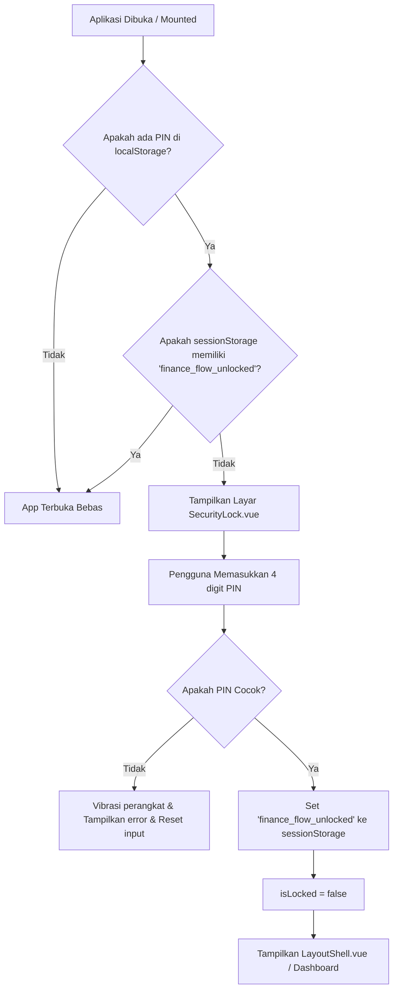

# Alur Keamanan PIN (security-flow.md)

Untuk melindungi privasi data keuangan pengguna, **Finance Flow** dilengkapi dengan sistem keamanan **4-Digit PIN Lock**.

---

## 🔒 Konsep & Cara Kerja Keamanan

Seluruh data keuangan disimpan di penyimpanan lokal browser (`localStorage`). Untuk mencegah akses tidak sah oleh orang lain yang memegang perangkat yang sama, aplikasi ini membatasi akses visual ke dashboard menggunakan PIN.

* **Penyimpanan PIN**: Kode PIN disimpan di `localStorage` dengan kunci `finance_flow_pin`.
* **Status Kunci Sesi**: Status verifikasi tersimpan dalam variabel reaktif `isLocked` di `App.vue` dan disinkronisasikan ke `sessionStorage` dengan kunci `finance_flow_unlocked`.

---

## 🔄 Alur Logika (Lifecycle Flow)



### 1. Inisialisasi Keamanan (`App.vue`)
Di dalam `App.vue`, fungsi `checkPin` mengevaluasi status saat aplikasi dimuat (`onMounted`):
```typescript
const checkPin = () => {
  const pin = localStorage.getItem('finance_flow_pin')
  if (pin) {
    storedPin.value = pin
    // Hanya kunci jika belum melakukan unlock di sesi peramban saat ini
    if (storedPin.value && !sessionStorage.getItem('finance_flow_unlocked')) {
      isLocked.value = true
    }
  } else {
    storedPin.value = null
    isLocked.value = false
  }
}
```

### 2. Komponen Keypad Keamanan (`SecurityLock.vue`)
* Layar kunci dirancang dalam posisi *fixed full-screen* dengan z-index tinggi (`z-9999`) dan backdrop blur untuk mencegah detail visual dashboard bocor ke latar belakang sebelum dibuka.
* Tombol angka dikonfigurasi sebagai keypad fisik virtual. Ketika pengguna memasukkan digit ke-4, verifikasi dilakukan dengan penundaan `200ms`.
* Jika benar, emit event `unlocked` dikirim ke parent (`App.vue`).
* Jika salah, memicu getaran perangkat (`navigator.vibrate`) selama `150ms` jika didukung oleh browser seluler/perangkat.

### 3. Pengaturan PIN Baru & Sinkronisasi Event (`pin-changed`)
* Pengguna dapat mengaktifkan, menonaktifkan, atau mengubah PIN melalui halaman **SettingsView.vue**.
* Ketika PIN diubah atau dihapus, aplikasi mengirimkan event kustom: `window.dispatchEvent(new Event('pin-changed'))`.
* `App.vue` mendengarkan event ini dan segera memperbarui state keamanan secara real-time tanpa memerlukan muat ulang halaman (page reload):
```typescript
onMounted(() => {
  checkPin()
  window.addEventListener('pin-changed', checkPin)
})
```

---

## 💡 Fitur Keamanan Tambahan
* **Sesi Sementara**: Karena status kunci sesi disimpan di `sessionStorage`, aplikasi akan secara otomatis mengunci kembali halaman jika tab ditutup lalu dibuka kembali, atau ketika browser di-restart.
* **Proteksi Brute-Force Keypad**: Untuk mencegah penyerang menebak PIN secara cepat (brute-force), komponen `SecurityLock.vue` membatasi jumlah percobaan input PIN yang salah. Jika pengguna salah memasukkan PIN sebanyak 5 kali berturut-turut, keypad virtual akan dikunci secara otomatis dengan waktu hitung mundur 30 detik. Selama masa penguncian ini, seluruh input dibekukan (`pointer-events-none`).
* **Kebijakan Keamanan Klien (Security Headers)**: Berkas `index.html` dilengkapi dengan tag meta kebijakan keamanan demi melindungi data keuangan lokal pengguna:
  * **Content-Security-Policy (CSP)**: Membatasi pemuatan skrip, style, koneksi API, dan media hanya dari asal yang terpercaya (`'self'`), serta memblokir eksekusi skrip eksternal yang tidak sah.
  * **Referrer-Policy**: Diatur ke `no-referrer` untuk menghindari kebocoran alamat URI internal ketika pengguna mengklik tautan eksternal.
  * **Permissions-Policy**: Menonaktifkan izin akses sensor perangkat keras yang sensitif (seperti `camera`, `microphone`, dan `geolocation`) karena tidak digunakan oleh aplikasi.
* **Hapus Semua Data**: Jika pengguna lupa PIN mereka, opsi pemulihan satu-satunya adalah melakukan "Clear Data" pada pengaturan browser yang akan menghapus data keuangan sekaligus PIN tersebut secara total (perlindungan privasi mutlak).
