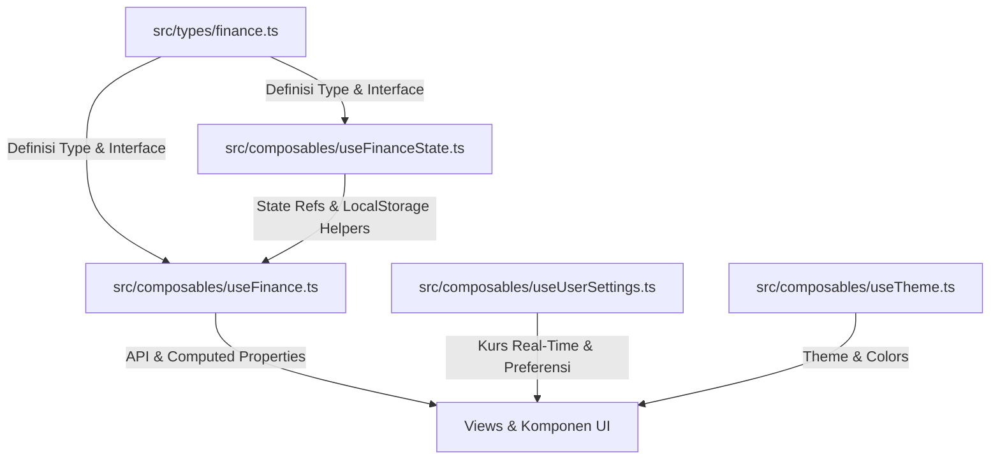

# Dokumentasi Manajemen State (state-management.md)

Seluruh data keuangan dan preferensi pengguna dalam **Finance Flow** dikelola secara reaktif dengan arsitektur modular yang memisahkan antara **Definisi Data (Types)**, **Penyimpanan State (Core State)**, dan **Aksi Bisnis (Composable API)**.

---

## ⚡ Arsitektur Manajemen State Tiga Lapis

Untuk menjaga performa dan keterbacaan kode, sistem manajemen state dibagi menjadi tiga layer utama:



### 1. Layer Definisi Data: `src/types/finance.ts`
Menampung seluruh struktur objek dan tipe data TypeScript yang digunakan dalam aplikasi (seperti `Transaction`, `CategoryItem`, `AssetItem`, `DebtItem`, `SavingsGoal`, `CurrencyType`, dsb.).

### 2. Layer Core State: `src/composables/useFinanceState.ts`
Menampung variabel reaktif global (`refs` singleton), nilai bawaan, dan fungsi utilitas database untuk sinkronisasi data lokal. Data dideklarasikan di level modul (*shared singleton state*) sehingga konsisten di seluruh views:
```typescript
export const transactions = ref<Transaction[]>([])
export const categories = ref<CategoryItem[]>([])
export const budgets = ref<BudgetItem[]>([])
export const assets = ref<AssetItem[]>([])
export const savingsGoals = ref<SavingsGoal[]>([])
export const recurringTransactions = ref<RecurringTransaction[]>([])
export const debts = ref<DebtItem[]>([])
export const initialized = ref(false)
```

### 3. Layer Composable API: `src/composables/useFinance.ts`
Merupakan pintu masuk utama (*front-facing API*) untuk views dan komponen UI. Berkas ini mengimpor state reaktif dari `useFinanceState.ts` dan mengekspor:
* **Computed Properties**: Perhitungan real-time seperti total saldo (`balance`), total pengeluaran (`expenseTotal`), total aset (`totalAssets`), peramalan anggaran (`nextMonthForecast`), wawasan otomatis (`automatedInsights`), dll.
* **Fungsi CRUD / Aksi**: Operasi penulisan & manipulasi (`addTransaction`, `updateAsset`, `adjustAssetValue`, `updateDebt`, `addSavingsGoal`, dll.).

---

## 🌐 Real-Time Currency Exchange Rate & Multi-Currency Engine (`useUserSettings.ts`)

`useUserSettings.ts` mengelola preferensi global pengguna serta **Sistem Kurs Mata Uang Real-Time & Konversi Multi-Mata Uang**:

```typescript
export const currency = ref<CurrencyType>('IDR')
export const exchangeRates = ref<Record<CurrencyType, number>>({
  IDR: 1, USD: 16000, EUR: 17500, SGD: 12000, JPY: 105, GBP: 20500
})
export const exchangeRateLastUpdated = ref<string | null>(null)
export const isFetchingRates = ref(false)
```

* **Pemuatan API Live (`fetchRealtimeRates`)**: Secara otomatis mengambil data nilai tukar mata uang real-time dari endpoint API pasar uang (`open.er-api.com/v6/latest/IDR`).
* **Cache Offline-First**: Hasil fetching tersimpan di `localStorage` (`finance-flow-live-exchange-rates`). Jika koneksi offline, aplikasi akan membaca nilai kurs terakhir secara instan.
* **Fungsi Konversi `convertCurrency(amount, targetCurrency, sourceCurrency)`**: Mengkonversi nominal keuangan sesuai nilai tukar riil sehingga pengubahan mata uang di pengaturan (misal IDR -> USD) mengubah nominal secara matematis tepat ($1 USD = ~Rp 16.000).
* **Format Uang `formatMoney(amount, sourceCurrency, targetCurrency)`**: Format angka menjadi string bermata uang lengkap dengan lambang (`$`, `€`, `S$`, `¥`, `£`, `Rp`).

---

## 🔍 Skala Layout & Aksesibilitas (`contentScale`)

Aplikasi menyediakan 3 pilihan skala tampilan di `useUserSettings.ts`:
* `normal` (100% Standard / Root 16px)
* `large` (120% Comfortable / Root 19.5px)
* `xlarge` (145% Ultra Clear / Root 23px)

Skala ini diterapkan pada `document.documentElement` (`<html>`) melalui kelas CSS (`scale-normal`, `scale-large`, `scale-xlarge`). Karena kelas UI menggunakan unit berbasis `rem` (`text-xs`, `text-sm`, `p-*`, `h-*`), seluruh halaman dan modal secara otomatis membesar/mengecil secara proporsional.

---

## 💾 Penyimpanan & Sinkronisasi Data (LocalStorage)

Semua data keuangan disimpan di browser pengguna menggunakan API `localStorage`.

* **Kunci Penyimpanan Utama**: `finance-app-data-v3` (dengan fallback otomatis membaca `finance-app-data-v2`).
* **Pemuatan Data (`loadData`)**: Mengambil string JSON dari `localStorage`, mem-parsing, menormalisasi data versi lama, dan memuatnya ke dalam ref state reaktif.
* **Penyimpanan Data (`saveData`)**: Penulisan ditrigger otomatis via `watch` di `useFinance.ts`, menyimpan data ke `localStorage`.

---

## 📐 Skema Struktur Data Utama (`types/finance.ts`)

### 1. Target Tabungan Multi-Mata Uang (`SavingsGoal`)
```typescript
export interface SavingsGoal {
  id: number
  name: string
  targetAmount: number
  currentAmount: number
  monthlyContribution: number
  targetDate: string
  currency?: CurrencyType // Opsional (IDR, USD, EUR, SGD, JPY, GBP)
}
```

### 2. Aset (`AssetItem`) & Penyesuaian Nilai (`AssetAdjustment`)
```typescript
export interface AssetItem {
  id: number
  name: string
  amount: number
  type: 'cash' | 'bank' | 'investment'
  date: string
  currency?: CurrencyType
  initialAmount?: number
  adjustments?: AssetAdjustment[]
}
```

### 3. Utang & Piutang (`DebtItem`)
```typescript
export interface DebtItem {
  id: number
  name: string
  counterpart: string
  amount: number
  dueDate: string
  kind: 'debt' | 'receivable'
  status: 'open' | 'paid'
}
```

