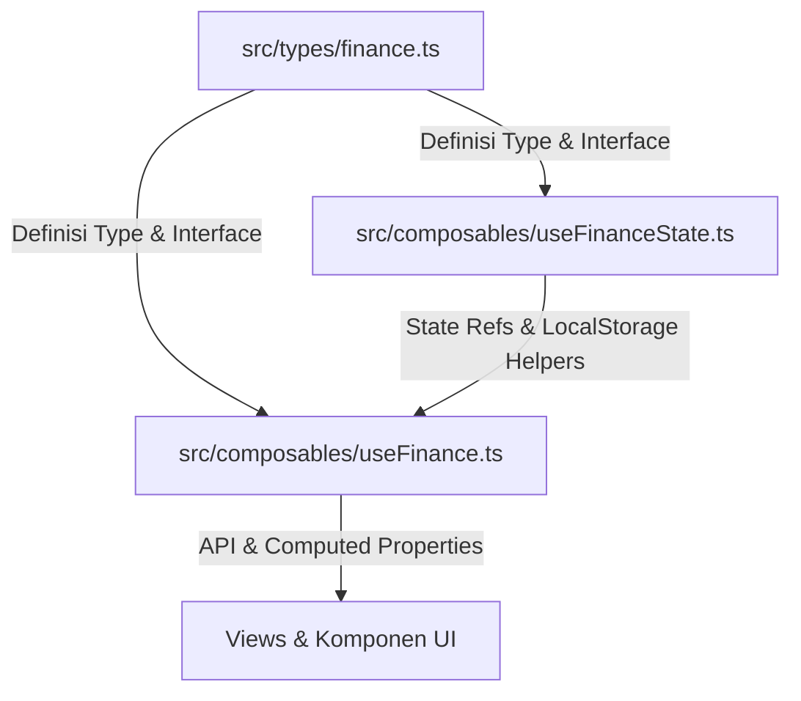

# Dokumentasi Manajemen State (state-management.md)

Seluruh data keuangan dalam **Finance Flow** dikelola secara reaktif dengan arsitektur modular yang memisahkan antara **Definisi Data (Types)**, **Penyimpanan State (Core State)**, dan **Aksi Bisnis (Composable API)**.

---

## ⚡ Arsitektur Manajemen State Tiga Lapis

Untuk menjaga performa dan keterbacaan kode, sistem manajemen state dibagi menjadi tiga layer utama:



### 1. Layer Definisi Data: `src/types/finance.ts`
Menampung seluruh struktur objek dan tipe data TypeScript yang digunakan dalam aplikasi (seperti `Transaction`, `CategoryItem`, `AssetItem`, `DebtItem`, dsb.).

### 2. Layer Core State: `src/composables/useFinanceState.ts`
Menampung variabel reaktif global (`refs` singleton), nilai bawaan, dan fungsi utilitas database untuk sinkronisasi data lokal. Karena refs dideklarasikan di level modul (di luar fungsi instansiasi), data akan terbagi secara konsisten di seluruh komponen (*shared singleton state*).
```typescript
// Dideklarasikan di src/composables/useFinanceState.ts
export const transactions = ref<Transaction[]>([])
export const categories = ref<CategoryItem[]>([])
export const budgets = ref<BudgetItem[]>([])
export const assets = ref<AssetItem[]>([])
export const savingsGoals = ref<SavingsGoal[]>([])
export const recurringTransactions = ref<RecurringTransaction[]>([])
export const debts = ref<DebtItem[]>([])
export const initialized = ref(false)
```

### 3. Layer Composable API: `src/composables/useFinance.ts`
Merupakan pintu masuk utama (*front-facing API*) untuk views dan komponen UI. Berkas ini mengimpor state reaktif dari `useFinanceState.ts` dan mengekspor:
* **Computed Properties**: Perhitungan real-time seperti total saldo, tren pengeluaran bulanan, analisis kategori, peramalan anggaran, wawasan otomatis, dll.
* **Fungsi CRUD / Aksi**: Operasi manipulasi data (`addTransaction`, `updateAsset`, `adjustAssetValue`, `updateDebt`, dll.).
* **Re-Export Tipe**: Mengekspor kembali tipe dari `src/types/finance.ts` agar pemanggilan tipe pada UI tetap seragam.

---

## 💾 Penyimpanan & Sinkronisasi Data (LocalStorage)

Semua data keuangan disimpan di browser pengguna menggunakan API `localStorage`.

* **Kunci Penyimpanan (Storage Key)**: `finance-app-data-v3` (dengan fallback otomatis untuk membaca versi lama `finance-app-data-v2`).
* **Pemuatan Data (`loadData`)**: Mengambil string JSON dari `localStorage`, mem-parsing, menormalisasi data (misal: menambahkan default values jika data dari versi lama), dan memuatnya ke dalam ref state reaktif masing-masing.
* **Penyimpanan Data (`saveData`)**: Setiap kali ada operasi penulisan (ditrigger secara otomatis via `watch` di `useFinance.ts`), data reaktif diserialisasikan ke string JSON dan disimpan kembali ke `localStorage`.

---

## 📐 Skema Struktur Data Utama (Model)

### 1. Transaksi (`Transaction`)
```typescript
export interface Transaction {
  id: number
  type: 'income' | 'expense'
  amount: number
  category: string
  subCategory?: string
  note: string
  date: string
}
```

### 2. Aset (`AssetItem`) & Penyesuaian Nilai (`AssetAdjustment`)
Nilai aset saat ini dihitung secara dinamis dari `initialAmount` ditambah seluruh riwayat apresiasi dikurangi penyusutan.
```typescript
export interface AssetAdjustment {
  id: number
  date: string
  type: 'appreciation' | 'depreciation'
  amount: number
  note: string
}

export interface AssetItem {
  id: number
  name: string
  amount: number // Hasil akhir (initialAmount + penyesuaian)
  type: 'cash' | 'bank' | 'investment'
  date: string
  initialAmount?: number
  adjustments?: AssetAdjustment[]
}
```

### 3. Utang & Piutang (`DebtItem`)
```typescript
export interface DebtItem {
  id: number
  name: string
  counterpart: string
  amount: number
  dueDate: string
  kind: 'debt' | 'receivable'
  status: 'open' | 'paid'
}
```
Untuk rincian tipe data lainnya seperti `BudgetItem`, `SavingsGoal`, dan `RecurringTransaction`, silakan merujuk langsung ke berkas kode [types/finance.ts](file:///home/m-riski/Programming/vue-laporan-keuangan/frontend/src/types/finance.ts).
